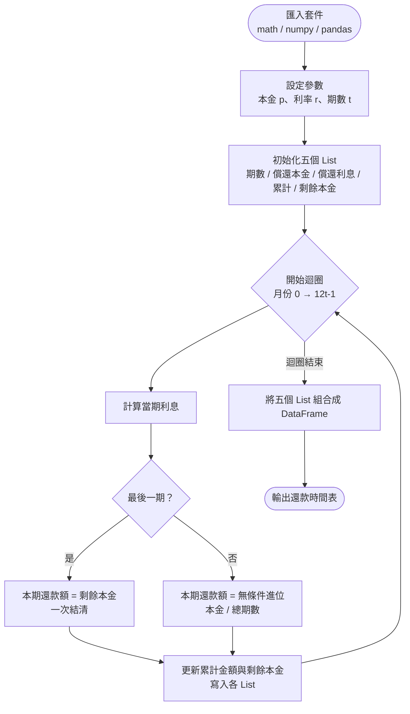

# HW1 — 等額分期還款表（Loan Amortization Schedule）

## 主題

計算每月定額本金還款的完整明細表，包含每期的償還本金、利息、累計金額以及剩餘未還本金。

## 公式說明

**每期償還本金**

$$\text{payment} = \left\lceil \frac{p}{12t} \right\rceil \quad (\text{最後一期直接結清剩餘本金})$$

**每期利息**

$$\text{interest} = \text{round}\!\left( p_{\text{剩餘}} \times \frac{r}{12} \right)$$

**剩餘未還本金**

$$p_{\text{剩餘}} \leftarrow p_{\text{剩餘}} - \text{payment}$$

## 流程圖



## 使用方法

開啟 [HW1.ipynb](HW1.ipynb)，在「參數設定」區塊修改以下三個變數後執行全部儲存格：

```python
p = 100000  # 本金
r = 0.05    # 年利率
t = 7       # 還款年數
```

## 學習心得

本題的核心在於熟悉 Python 迴圈與 List 的操作。  
利率是以年利率 / 12 計算月利息，且最後一期需要特別處理，將剩餘本金一次結清，避免浮點數誤差導致尾差。  
最後以 pandas DataFrame 整理輸出，使結果易於閱讀。
