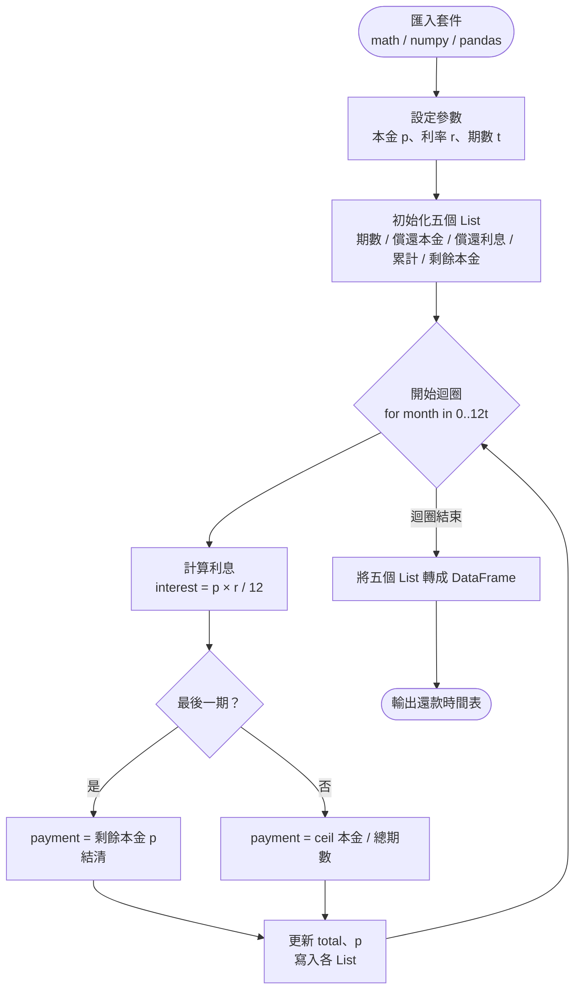

# HW1 — 等額分期還款表（Loan Amortization Schedule）

## 主題

計算每月定額本金還款的完整明細表，包含每期的償還本金、利息、累計金額以及剩餘未還本金。

## 公式說明

| 欄位 | 計算方式 |
|------|---------|
| 期數 | 年數 × 12（月數） |
| 償還本金 | ceil(本金 / 總期數)；最後一期直接結清剩餘本金 |
| 償還利息 | round(剩餘未還本金 × 年利率 / 12) |
| 本金利息累計 | 歷期已償還本金 + 利息之總和 |
| 剩餘未還本金 | 本金 − 已償還本金 |

## 流程圖



## 使用方法

開啟 [HW1.ipynb](HW1.ipynb)，在「參數設定」區塊修改以下三個變數後執行全部儲存格：

```python
p = 100000  # 本金
r = 0.05    # 年利率
t = 7       # 還款年數
```

## 學習心得

本題的核心在於熟悉 Python 迴圈與 List 的操作。  
利率是以年利率 / 12 計算月利息，且最後一期需要特別處理，將剩餘本金一次結清，避免浮點數誤差導致尾差。  
最後以 pandas DataFrame 整理輸出，使結果易於閱讀。
