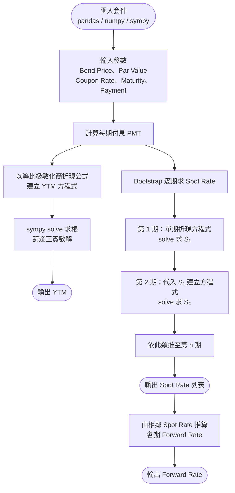

# HW2 — 殖利率 / 即期利率 / 遠期利率（YTM / Spot Rate / Forward Rate）

## 主題

從債券市場價格出發，計算到期殖利率（YTM），再以 Bootstrap 方式逐期推導即期利率（Spot Rate），最後由即期利率計算遠期利率（Forward Rate）。

## 公式說明

**YTM**

$$\text{Bond Price} = \sum_{t=1}^{n} \frac{PMT}{(1+YTM)^t} + \frac{Par}{(1+YTM)^n}$$

利用等比級數化簡後交由 `sympy.solve()` 數值求解，篩選正實數根。

**Spot Rate（Bootstrap）**

$$\text{Spot}_1: \quad \frac{PMT + Par}{1 + S_1} = Price$$

$$\text{Spot}_2: \quad \frac{PMT}{1+S_1} + \frac{PMT + Par}{(1+S_2)^2} = Price$$

**Forward Rate**

$$f(0,1) = S(1), \quad f(0,2) = S(2), \quad f(1,2) = \frac{S(2)}{S(1)}, \quad \cdots$$

## 流程圖



## 使用方法

開啟 [HW2.ipynb](HW2.ipynb)，在「參數設定」區塊輸入債券資訊後執行全部儲存格：

```python
Bond_Price  = 800   # 市場債券價格
Par_Value   = 1000  # 面值
Coupon_Rate = 0.10  # 票面利率
Maturity    = 2     # 到期年數
Payment     = 1     # 每年付息次數
```

## 學習心得

這週的難度明顯提升，重點在於釐清 YTM、Spot Rate 與 Forward Rate 的意涵與推導順序。  
YTM 用等比級數化簡後以 `sympy.solve()` 求數值解，但會同時得到正數、負數和複數解，需要用條件判斷篩選。  
Spot Rate 採用 Bootstrap 方法逐期求解，Forward Rate 則直接由 Spot Rate 推導。  
由於時間限制，Spot Rate 的迴圈版本尚未完成，目前以兩期作為 Demo。
