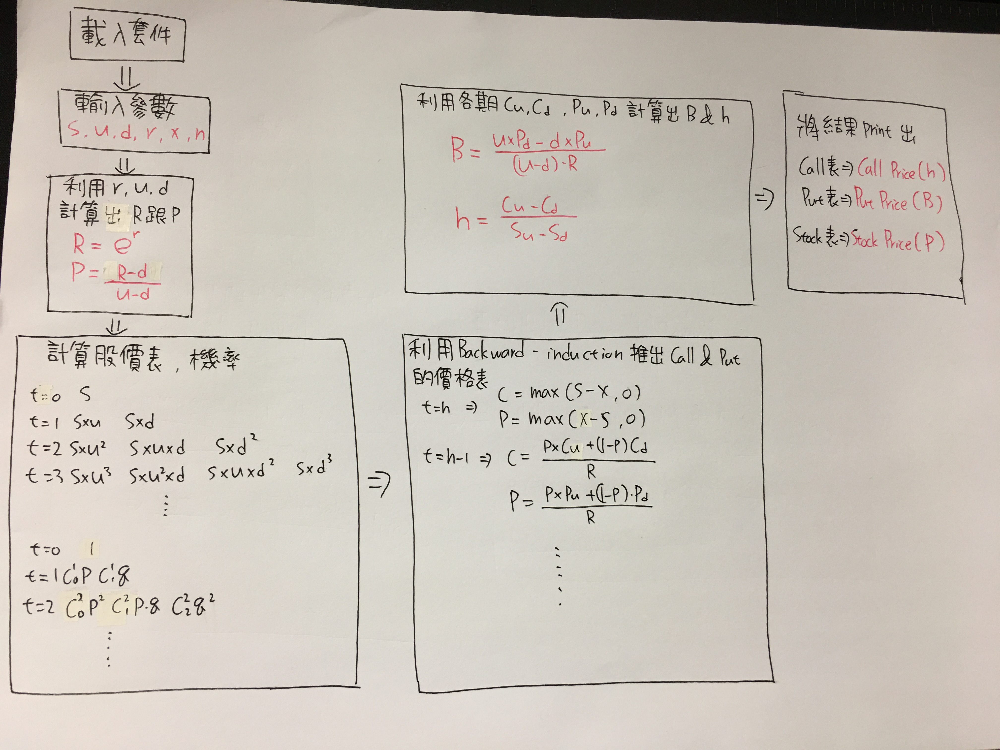

# 財務工程Homework3

1.  使用方法：

  將參數輸入參數欄之後，運行整個程式即可進行運算，其中共分成三個表(股價表、買權表、賣權表)，
  由左至右排序為上漲次數的多寡，最左為所有期數均上漲之價格，而由上至下則是依期數排序，
  最上方為第0期，而最下方為最後一期，後面的括號分別為機率、股數，債券數量。
--

2.  學習歷程:

3.  流程圖

[id]: <http://example.com/>  "Optional Title Here"
