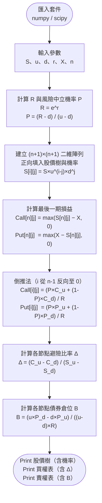

# HW3 — 二項式選擇權定價模型（Binomial Option Pricing Model）

## 主題

建立 n 期二項式股價樹（BOPM），計算每個節點的股價與機率，再以風險中立倒推法（Backward-induction）求出買權（Call）及賣權（Put）的現值，同時輸出每期的避險比率 Δ 與債券倉位 B。

## 公式說明

**風險中立機率**

$$R = e^r, \quad P = \frac{R - d}{u - d}$$

**股價樹（正向）**

$$S[i][j] = S_0 \times u^{(i-j)} \times d^j, \quad \text{機率} = \binom{i}{j} P^{i-j}(1-P)^j$$

**倒推法**

$$C[i][j] = \frac{P \cdot C[i+1][j] + (1-P) \cdot C[i+1][j+1]}{R}$$

**避險比率與債券倉位**

$$\Delta = \frac{C_u - C_d}{S_u - S_d}, \quad B = \frac{u \cdot P_d - d \cdot P_u}{(u-d) \cdot R}$$

## 流程圖


```mermaid
flowchart TD
    A([匯入套件\nnumpy / scipy]) --> B[輸入參數\nS、u、d、r、X、n]
    B --> C["計算 R 與風險中立機率 P\nR = e^r\nP = (R - d) / (u - d)"]
    C --> D["建立 (n+1)×(n+1) 二維陣列\n正向填入股價樹與機率\nS[i][j] = S×u^(i-j)×d^j"]
    D --> E["計算最後一期損益\nCall[n][j] = max(S[n][j] − X, 0)\nPut[n][j]  = max(X − S[n][j], 0)"]
    E --> F["倒推法（i 從 n-1 反向至 0）\nCall[i][j] = (P×C_u + (1-P)×C_d) / R\nPut[i][j]  = (P×P_u + (1-P)×P_d) / R"]
    F --> G["計算各節點避險比率 Δ\nΔ = (C_u - C_d) / (S_u - S_d)"]
    G --> H["計算各節點債券倉位 B\nB = (u×P_d - d×P_u) / ((u-d)×R)"]
    H --> I(["Print 股價樹（含機率）\nPrint 買權表（含 Δ）\nPrint 賣權表（含 B）"])
```

## 使用方法

開啟 [HW3.ipynb](HW3.ipynb)，在「參數」區塊設定以下變數後執行全部儲存格：

```python
S = 160     # 初始股價
u = 1.5     # 上漲幅度
d = 0.5     # 下跌幅度
r = 0.18232 # 離散利率（連續複利）
X = 150     # 履約價
n = 5       # 期數
```

輸出共三張表（股價表、買權表、賣權表），格式為：`價格 (機率/Δ/B)`，由左至右為上漲次數由多到少，由上至下為期數 0 到 n。

## 學習心得

BOPM 的難點在於以二維陣列模擬樹狀結構。  
股價表是正向逐層計算，而選擇權價格表需要先算最後一期的損益（到期條件），再從後往前倒推，因此迴圈的索引要做反轉。  
機率部分直接套用二項式定理，以 `scipy.special.comb` 計算組合數。
