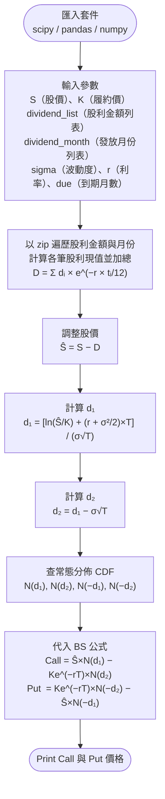

# HW4 — Black-Scholes 含離散股利（Black-Scholes with Discrete Dividends）

## 主題

在已知現金股利的情況下，使用調整後的 Black-Scholes 公式計算歐式買權（Call）與賣權（Put）的理論價格。

## 公式說明

**股利現值**

$$D = \sum_i d_i \cdot e^{-r \cdot t_i}$$

**調整後股價**

$$\hat{S} = S - D$$

**d₁ 與 d₂**

$$d_1 = \frac{\ln(\hat{S}/K) + (r + \sigma^2/2)T}{\sigma\sqrt{T}}, \quad d_2 = d_1 - \sigma\sqrt{T}$$

**Black-Scholes 定價公式**

$$\text{Call} = \hat{S} \cdot N(d_1) - K \cdot e^{-rT} \cdot N(d_2)$$

$$\text{Put} = K \cdot e^{-rT} \cdot N(-d_2) - \hat{S} \cdot N(-d_1)$$

## 流程圖



## 使用方法

開啟 [HW4.ipynb](HW4.ipynb)，在「Input」區塊設定參數後執行全部儲存格：

```python
S              = 75     # 股價
K              = 65     # 履約價
dividend_list  = [1, 1] # 各期股利金額（元）
dividend_month = [1, 4] # 各期股利發放月份
sigma          = 0.35   # 年化波動度
r              = 0.06   # 無風險利率
due            = 6      # 到期月數
```

**輸出：**
- Call = 12.80
- Put = 2.85

## 學習心得

本週重點在於理解離散股利的折現調整。  
將每筆股利依其發放時間折現後加總為 D，從現股價扣除得到 `S_hat`，再代入標準 BS 公式。  
使用 `zip` 同時遍歷金額與月份列表，讓程式更為簡潔。
