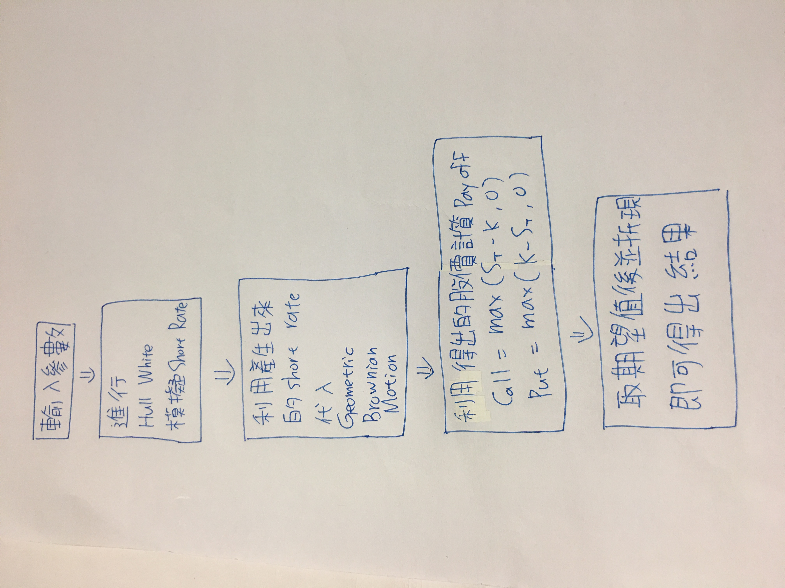

# 財務工程 第五次作業
---
1.  使用方法：  
在input的地方輸入參數，並進行運算即可  

---
2.  學習歷程：  
這週的作業難度比起上次作業較為困難，主要是要先利用Hull White產生Short Rate，   
再利用Geometric brownian motion去模擬股價，比較要注意的點是兩個的shape要去對齊，   
其餘就只要分別計算損益，再取期望值就好，最後進行折線即可得到選擇權價格。

3.  流程圖

