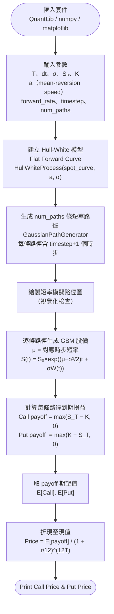

# HW5 — Hull-White + 幾何布朗運動 Monte Carlo 選擇權定價

## 主題

結合兩個隨機過程進行 Monte Carlo 模擬：  
1. **Hull-White 模型**：模擬隨機短期利率路徑  
2. **幾何布朗運動（GBM）**：以短率作為漂移項模擬股價路徑  

取到期損益的期望值後折現，求得歐式選擇權價格。

## 公式說明

**Hull-White 短率模型**

$$dr(t) = [a(\theta(t) - r(t))] \, dt + \sigma \, dW(t)$$

**幾何布朗運動**

$$S(t) = S_0 \exp\!\left[\left(\mu - \frac{\sigma^2}{2}\right)t + \sigma W(t)\right]$$

其中 $\mu$ 取自對應時步的短率路徑。

**到期損益**

$$\text{Call payoff} = \max(S_T - K,\, 0)$$
$$\text{Put payoff}  = \max(K - S_T,\, 0)$$

**折現**

$$\text{Price} = \frac{E[\text{payoff}]}{(1 + r/12)^{12T}}$$

## 流程圖


```mermaid
flowchart TD
    A([匯入套件\nQuantLib / numpy / matplotlib]) --> B["輸入參數\nT、dt、σ、S₀、K\na（mean-reversion speed）\nforward_rate、timestep、num_paths"]
    B --> C["建立 Hull-White 模型\nFlat Forward Curve\nHullWhiteProcess(spot_curve, a, σ)"]
    C --> D["生成 num_paths 條短率路徑\nGaussianPathGenerator\n每條路徑含 timestep+1 個時步"]
    D --> E["繪製短率模擬路徑圖\n（視覺化檢查）"]
    E --> F["逐條路徑生成 GBM 股價\nμ = 對應時步短率\nS(t) = S₀×exp((μ−σ²/2)t + σW(t))"]
    F --> G["計算每條路徑到期損益\nCall payoff = max(S_T − K, 0)\nPut payoff  = max(K − S_T, 0)"]
    G --> H["取 payoff 期望值\nE[Call], E[Put]"]
    H --> I["折現至現值\nPrice = E[payoff] / (1 + r/12)^(12T)"]
    I --> J(["Print Call Price & Put Price"])
```

## 使用方法

開啟 [HW5.ipynb](HW5.ipynb)，在「參數」區塊設定後執行全部儲存格：

```python
T            = 1        # 到期年數
dt           = 0.01     # 時間步長
sigma        = 0.1      # 波動度
S0           = 100      # 初始股價
K            = 80       # 履約價
a            = 0.1      # mean-reversion speed
timestep     = 12       # 每年時步數
forward_rate = 0.05     # 遠期利率
num_paths    = 1000     # 模擬路徑數
```

**輸出：**
- Call ≈ 24.37
- Put ≈ 0.004

## 學習心得

本週難度最高，需要整合兩個不同的隨機過程。  
關鍵在於讓 Hull-White 產出的短率路徑與 GBM 的時步對齊（`shape` 要一致），才能正確將短率當作每期漂移項使用。  
模擬完所有路徑後，分別計算 Call/Put 的到期損益，取期望值再折現，即可得到選擇權現值。  
使用 QuantLib 大幅簡化了 Hull-White 的實作難度。
