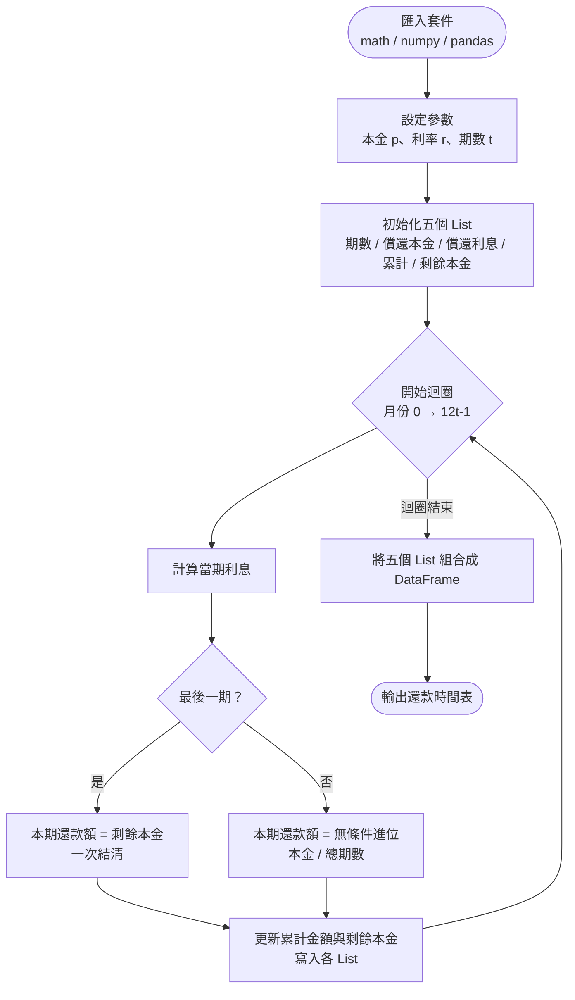
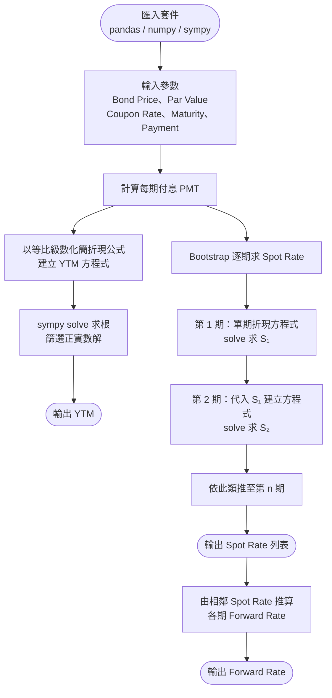
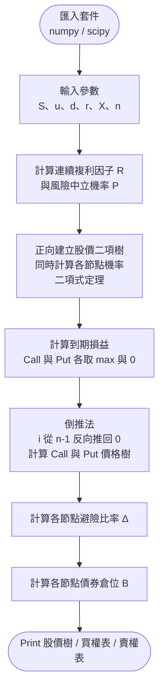
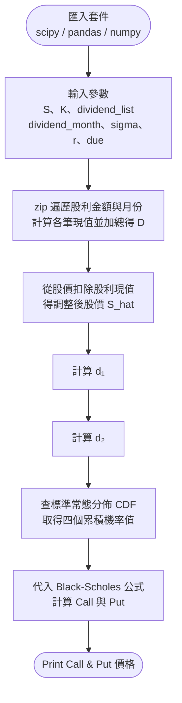
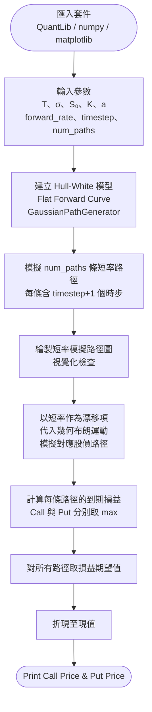

# 財務工程作業集 — 王裕勛

**學號：** R08323031 ｜ **系所：** 經碩一

---

## 目錄

| 作業 | 主題 | 核心方法 | Notebook |
|------|------|----------|----------|
| [HW1](#hw1) | 等額分期還款表 | 迴圈計算、DataFrame | [HW1.ipynb](HW1/HW1.ipynb) |
| [HW2](#hw2) | 殖利率 / 即期利率 / 遠期利率 | 數值求解（SymPy Solve）、Bootstrap | [HW2.ipynb](HW2/HW2.ipynb) |
| [HW3](#hw3) | 二項式選擇權定價（BOPM） | 倒推法、二項樹 | [HW3.ipynb](HW3/HW3.ipynb) |
| [HW4](#hw4) | Black-Scholes 含股利 | BS 公式、常態分佈 | [HW4.ipynb](HW4/HW4.ipynb) |
| [HW5](#hw5) | Hull-White + Monte Carlo 選擇權定價 | 短期利率模擬、幾何布朗運動 | [HW5.ipynb](HW5/HW5.ipynb) |

---

## HW1

### 等額分期還款表（Loan Amortization Schedule）

計算每月還款金額，拆解為償還本金、利息、累計總額及剩餘本金，並以 DataFrame 呈現完整還款時間表。

**技術重點：** 等額本金分期公式、Python 迴圈、pandas DataFrame



**輸出範例：**

| 期數 | 償還本金 | 償還利息 | 本金利息累計 | 剩餘未還本金 |
|------|---------|---------|------------|------------|
| 1 | 1,191 | 417 | 1,608 | 98,809 |
| … | … | … | … | … |
| 84 | 1,147 | 5 | 117,702 | 0 |

---

## HW2

### 殖利率 / 即期利率 / 遠期利率（YTM / Spot Rate / Forward Rate）

從債券市場價格出發，先求 YTM，再以 Bootstrap 逐期推導即期利率，最後計算遠期利率。

**技術重點：** 等比級數折現公式、SymPy `solve()`、Bootstrap 逐期求解



---

## HW3

### 二項式選擇權定價模型（Binomial Option Pricing Model）

建立完整的股價二項樹，利用風險中立機率與倒推法計算買權與賣權價格，同時輸出避險比率（Delta）與債券倉位（B）。

**技術重點：** 風險中立定價、Backward-induction、二維陣列



**輸出範例（買權，節點格式：價格（Δ））：**

```
108.842 (0.903)
173.932 (0.941)   29.526 (0.633)
276.476 (0.972)   50.616 (0.723)    0.0 (0.0)
...
```

---

## HW4

### Black-Scholes 含離散股利（Black-Scholes with Discrete Dividends）

以 Black-Scholes 公式計算含已知現金股利的歐式選擇權價格，先將股利折現從股價扣除，再代入 BS 公式。

**技術重點：** Black-Scholes 公式、現金股利折現調整、常態分佈 CDF



**輸出：**
- Call = 12.80
- Put = 2.85

---

## HW5

### Hull-White + 幾何布朗運動 Monte Carlo 選擇權定價

以 Hull-White 模型模擬隨機短期利率，再將短期利率作為漂移項代入幾何布朗運動（GBM），透過 Monte Carlo 模擬大量路徑，取到期損益的期望值後折現，得到選擇權價格。

**技術重點：** Hull-White 短率模型、GBM、Monte Carlo 模擬、QuantLib



**輸出：**
- Call ≈ 24.37
- Put ≈ 0.004

---

*Repository: [yuhsunwang/financial_engineering](https://github.com/yuhsunwang/financial_engineering)*
